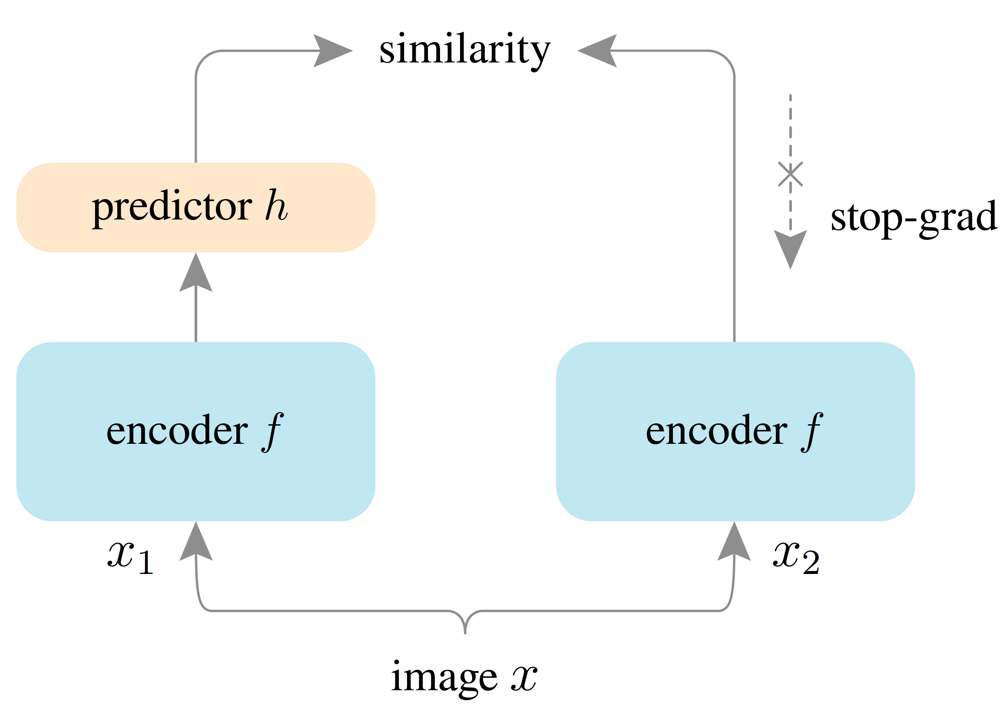

<div align="center">

<h1>SimSiam</h1>

[](https://github.com/a5chin/simsiam/actions/workflows/linting.yml) [](https://img.shields.io/pypi/l/ansicolortags.svg)

[](https://www.python.org/) [](https://pytorch.org/)

</div>



## Usage

### Installation
```sh
pip install -r requirements.txt
```

## Example
```sh
cd examples
python simsiam.py
```

## Citations
```bibtex
@Article{chen2020simsiam,
    author  = {Xinlei Chen and Kaiming He},
    title   = {Exploring Simple Siamese Representation Learning},
    journal = {arXiv preprint arXiv:2011.10566},
    year    = {2020},
}
```